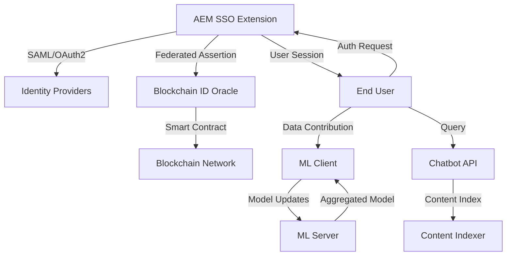

# Federated Identity-Driven AEM Project

## Overview

This project is a modular system integrating federated identity management with Adobe Experience Manager (AEM), blockchain-based identity verification, federated machine learning, and an indexing chatbot. The architecture is designed for secure, scalable, and intelligent digital experiences. 

---

## Architecture Diagram



---

## Detailed Analysis

### Federated Identity Management (AEM SSO Extension)
- **Role:** Acts as the authentication gateway for users accessing AEM.
- **Integration:** Supports SAML and OAuth2, allowing organizations to use their existing identity providers (Okta, Azure AD, etc.).
- **Security:** Handles user provisioning, session management, and role mapping securely within AEM.

### Blockchain-Based Identity Verification
- **Smart Contract:** `BIOVOracle.sol` provides decentralized identity attestation, ensuring that user identities are verifiable and tamper-proof.
- **Oracle Scripts:** `deploy_oracle.js` and Truffle configuration automate deployment and interaction with the blockchain.
- **Benefits:** Enhances trust and auditability for federated identities.

### Federated Machine Learning
- **Privacy:** EMR data remains on-premise; only model updates are shared, preserving privacy.
- **Workflow:**
  - `dafa_client.py` runs on user/data owner side, trains on local data.
  - `dafa_server.py` aggregates updates to build a global model.
- **Use Case:** Enables collaborative analytics without exposing sensitive data.

### Indexing Chatbot
- **Content Indexing:** `indexer.py` processes and indexes content for fast retrieval.
- **Chatbot API:** `chatbot_api.py` provides a natural language interface for users to query indexed content.
- **Integration:** Can be embedded in AEM or used as a standalone service for intelligent search.

---

## Project Structure

### 1. `aem-sso-extension/`
- **Purpose:** Java-based extension for AEM to enable Single Sign-On (SSO) and federated identity.
- **Key Files:**
  - `pom.xml`: Maven build configuration.
  - `src/com/org/sso/SSOHandler.java`: Main handler for SSO logic.
- **Features:**
  - Integrates SAML/OAuth2 providers.
  - Handles user provisioning and session management.

### 2. `blockchain-id/`
- **Purpose:** Smart contract and scripts for blockchain-based identity verification.
- **Key Files:**
  - `contracts/BIOVOracle.sol`: Solidity smart contract for identity oracle.
  - `scripts/deploy_oracle.js`: Script to deploy the oracle contract.
  - `truffle-config.js`: Truffle configuration for Ethereum development.
- **Features:**
  - Decentralized identity verification.
  - Oracle for federated identity attestation.

### 3. `docker/`
- **Purpose:** Containerization and orchestration for the entire system.
- **Key Files:**
  - `docker-compose.yml`: Multi-service orchestration.
  - `Dockerfile.aem`, `Dockerfile.federated`, `Dockerfile.ganache`: Dockerfiles for AEM, federated ML, and blockchain testnet.
- **Features:**
  - Easy local and cloud deployment.
  - Isolated environments for each service.

### 4. `federated-ml/`
- **Purpose:** Federated machine learning client and server for privacy-preserving analytics.
- **Key Files:**
  - `dafa_client.py`: Client for federated learning.
  - `dafa_server.py`: Server for aggregating model updates.
  - `data/simulated_emr.json`: Example EMR data for ML.
- **Features:**
  - Distributed model training.
  - Privacy-preserving data analytics.

### 5. `indexing-chatbot/`
- **Purpose:** Chatbot and content indexer for intelligent search and interaction.
- **Key Files:**
  - `chatbot_api.py`: API for chatbot interaction.
  - `indexer.py`: Indexes content for fast retrieval.
  - `content.jsonl`: Sample content for indexing.
- **Features:**
  - Natural language search.
  - Integration with indexed content.

---

## Getting Started

### Prerequisites
- Java 8+ and Maven (for AEM extension)
- Node.js and npm (for blockchain scripts)
- Python 3.8+ (for federated ML and chatbot)
- Docker & Docker Compose

### Setup Steps

1. **Clone the repository:**
   ```sh
   git clone https://github.com/your-org/aem_federated_identity_ai_project.git
   cd aem_federated_identity_ai_project
   ```

2. **Build and run with Docker Compose:**
   ```sh
   docker-compose up --build
   ```

3. **Manual setup (if not using Docker):**
   - Build AEM extension:
     ```sh
     cd aem-sso-extension
     mvn clean install
     ```
   - Deploy blockchain contracts:
     ```sh
     cd blockchain-id
     npm install
     npx truffle migrate
     ```
   - Start federated ML server/client:
     ```sh
     cd federated-ml
     python dafa_server.py
     python dafa_client.py
     ```
   - Run chatbot API:
     ```sh
     cd indexing-chatbot
     python chatbot_api.py
     ```

---

## Usage

- **AEM SSO:** Integrate the built extension into your AEM instance for federated login.
- **Blockchain ID:** Use the deployed smart contract for decentralized identity verification.
- **Federated ML:** Train models on distributed EMR data without centralizing sensitive information.
- **Chatbot:** Query indexed content using natural language.

---

## Contributing

1. Fork the repository.
2. Create a feature branch (`git checkout -b feature/your-feature`).
3. Commit and push your changes.
4. Open a pull request.

---

## License

This project is licensed under the MIT License.